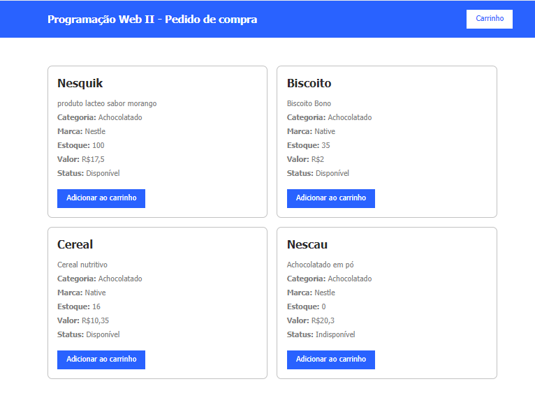

##  🎀✨ cadEcommerce ✨🎀
 
[Introdução](#-introdu%C3%A7%C3%A3o)

[Descrição](#-descri%C3%A7%C3%A3o)

[Sobre a Atividade](#-sobre-a-atividade)

[Tecnologias Utilizadas](#-tecnologias-utilizadas)

[Funcionalidades](#%EF%B8%8F-funcionalidades)

[Exemplo de Uso](#-exemplo-de-uso)

[Fontes Consultadas](#-fontes-consultadas )

[Autores](#-autores)




# 📌 Introdução
**form_cadEndereco** é um sistema de pedido de compra desenvolvido como parte da disciplina de Programação Web II, ministrada pelo professor Leonardo Rocha. Nosso objetivo é oferecer uma plataforma intuitiva para gerenciar categorias, marcas e produtos, além de proporcionar uma experiência de compra fluida e eficiente.

# 📖 Descrição
O **form_cadEndereco** é uma aplicação web que visa simplificar o gerenciamento de produtos e pedidos. Com uma interface amigável e funcionalidades robustas, os usuários podem adicionar e gerenciar produtos, categorias e marcas, além de gerenciar seu carrinho de compras e visualizar resumos detalhados dos pedidos.

# 🌼 Sobre a Atividade
Este projeto foi desenvolvido dentro de sala de aula, com o apoio e orientação do professor Leonardo Rocha. O desafio foi colocar em prática o que aprendemos na disciplina de Programação Web II.

**O projeto teve como foco principal:**
- **Integração entre Frontend e Backend:** Aprendemos a conectar a interface que os usuários veem com a lógica que roda nos bastidores, garantindo que tudo funcione de maneira coesa. 
- **Gerenciamento de Banco de Dados:** Trabalhamos na organização e armazenamento eficiente dos dados, assegurando que o sistema possa lidar com informações de maneira eficaz.
- **Desenvolvimento de Funcionalidades Dinâmicas:** Implementamos características interativas para tornar a experiência do usuário mais envolvente e intuitiva.

# 💻 Tecnologias Utilizadas

| Tecnologia         | Descrição                         |
|--------------------|-----------------------------------|
| **VS Code**        | Editor de código-fonte            |
| **GitHub**         | Plataforma de hospedagem de código|
| **HTML**           | Linguagem de marcação             |
| **CSS**            | Folhas de estilo em cascata       |
| **JavaScript**     | Linguagem de programação para web |
| **jQuery**         | Biblioteca JavaScript             |
| **PHP**            | Linguagem de script no servidor   |
| **MySQL**          | Sistema de gerenciamento de banco de dados|

# 🛠️ Funcionalidades

### 📂 Cadastro de Categorias
- 📝 **Criar novas categorias**: Adicione categorias para organizar seus produtos.
- ✏️ **Editar e excluir categorias**: Modifique ou remova categorias existentes conforme necessário.
- 📋 **Visualizar categorias**: Consulte a lista de todas as categorias cadastradas.

### 📂 Cadastro de Marcas
- 📝 **Adicionar novas marcas**: Registre marcas para associar aos produtos.
- ✏️ **Atualizar e remover marcas**: Edite ou exclua marcas quando necessário.
- 📋 **Visualizar marcas**: Acesse a lista completa de marcas.

### 📂 Cadastro de Produtos
- 📝 **Inserir novos produtos**: Adicione produtos com informações detalhadas.
- ✏️ **Editar e excluir produtos**: Atualize ou remova produtos existentes.
- 📋 **Visualizar produtos**: Consulte a lista de todos os produtos cadastrados.

### 🛒 Gerenciamento de Carrinho
- ➕ **Adicionar produtos ao carrinho**: Inclua itens ao seu carrinho de compras.
- 🔄 **Atualizar quantidades e remover itens**: Modifique quantidades ou remova produtos do carrinho.
- 🛒 **Visualizar o conteúdo do carrinho**: Confira todos os itens no carrinho.

### 📄 Resumo do Pedido
- 🧾 **Exibir um resumo detalhado**: Veja um resumo completo do pedido antes da finalização.
- 👀 **Revisar a seleção de produtos**: Confirme os produtos escolhidos antes de completar a compra.

# 📋 Exemplo de Uso

### **Cadastro de Categorias**
1. Acesse a página de categorias e clique em "Adicionar Nova Categoria".
2. Preencha o formulário com o nome da categoria e clique em "Salvar".

```php
<?php
// Função para adicionar nova categoria
function adicionarCategoria($nomeCategoria) {
    $conn = new mysqli('localhost', 'usuario', 'senha', 'banco');
    $sql = "INSERT INTO categorias (nome) VALUES ('$nomeCategoria')";
    if ($conn->query($sql) === TRUE) {
        echo "Categoria adicionada com sucesso";
    } else {
        echo "Erro: " . $sql . "<br>" . $conn->error;
    }
    $conn->close();
}
?>
```
### ``Explicação do Código:``
A função **adicionarCategoria** é responsável por inserir uma nova categoria no banco de dados. Primeiro, ela cria uma nova conexão com o banco de dados usando a classe **mysqli**, fornecendo as credenciais e o nome do banco de dados. Em seguida, a função define uma instrução **SQL** para inserir a nova categoria na tabela categorias. A função executa a query usando **$conn->query($sql)**. Se a execução for bem-sucedida, uma mensagem de sucesso é exibida. Caso contrário, é exibida uma mensagem de erro com detalhes. Finalmente, a função fecha a conexão com o banco de dados.

### **Cadastro de Marcas**
1. Acesse a página de marcas e clique em "Adicionar Nova Marca".
2. Preencha o formulário com o nome da marca e clique em "Salvar".
```php
<?php
// Função para adicionar nova marca
function adicionarMarca($nomeMarca) {
    $conn = new mysqli('localhost', 'usuario', 'senha', 'banco');
    $sql = "INSERT INTO marcas (nome) VALUES ('$nomeMarca')";
    if ($conn->query($sql) === TRUE) {
        echo "Marca adicionada com sucesso";
    } else {
        echo "Erro: " . $sql . "<br>" . $conn->error;
    }
    $conn->close();
}
?>
```
### ``Explicação do Código:``
A função **adicionarMarca** realiza a inserção de uma nova marca na tabela marcas. Assim como no exemplo anterior, ela estabelece uma conexão com o banco de dados e define uma instrução SQL para a inserção. A execução da query é feita com o método **$conn->query($sql)**. Se a operação for bem-sucedida, uma mensagem de confirmação é exibida; caso contrário, é apresentada uma mensagem de erro. A conexão com o banco de dados é fechada após a execução da query.

### **Cadastro de Produtos**
1. Acesse a página de produtos e clique em "Adicionar Novo Produto".
2. Preencha o formulário com as informações do produto e clique em "Salvar".
```php
<?php
// Função para adicionar novo produto
function adicionarProduto($categoria, $marca, $nomeProduto, $descricao, $estoque, $preco) {
    $conn = new mysqli('localhost', 'usuario', 'senha', 'banco');
    $sql = "INSERT INTO produtos (IDCATEGORIA, IDMARCA, NOME, DESCRICAO, ESTOQUE, PRECO) VALUES ('$categoria', '$marca', '$nomeProduto', '$descricao', '$estoque', '$preco')";
    if ($conn->query($sql) === TRUE) {
        echo "Produto adicionado com sucesso";
    } else {
        echo "Erro: " . $sql . "<br>" . $conn->error;
    }
    $conn->close();
}
?>
```
### ``Explicação do Código:``
A função **adicionarProduto** adiciona um novo produto à **tabela produtos**. Primeiro, uma conexão com o banco de dados é criada. A instrução SQL é configurada para inserir os dados do produto, incluindo categoria, marca, nome, descrição, estoque e preço. A query é executada com **$conn->query($sql)**. Se a operação for bem-sucedida, uma mensagem de sucesso é exibida. Se ocorrer um erro, uma mensagem detalhando o erro é apresentada. A conexão com o banco de dados é encerrada após a execução.

### **Gerenciamento de Carrinho**
1. Adicione um produto ao carrinho clicando em "Adicionar ao Carrinho" na página de produtos.
2. Acesse o carrinho clicando em "Ver Carrinho" no menu.
3. Para atualizar a quantidade de um produto, ajuste a quantidade e clique em "Atualizar".
4. Para remover um produto, clique em "Remover" ao lado do item desejado.
```php
<?php
// Função para adicionar um produto ao carrinho
function adicionarAoCarrinho($produtoId, $quantidade) {
    session_start();
    if (!isset($_SESSION['carrinho'])) {
        $_SESSION['carrinho'] = array();
    }
    if (isset($_SESSION['carrinho'][$produtoId])) {
        $_SESSION['carrinho'][$produtoId] += $quantidade;
    } else {
        $_SESSION['carrinho'][$produtoId] = $quantidade;
    }
}

// Função para atualizar a quantidade de um produto no carrinho
function atualizarCarrinho($produtoId, $quantidade) {
    session_start();
    if (isset($_SESSION['carrinho'][$produtoId])) {
        $_SESSION['carrinho'][$produtoId] = $quantidade;
        if ($_SESSION['carrinho'][$produtoId] <= 0) {
            unset($_SESSION['carrinho'][$produtoId]);
        }
    }
}
// Função para remover um produto do carrinho
function removerDoCarrinho($produtoId) {
    session_start();
    if (isset($_SESSION['carrinho'][$produtoId])) {
        unset($_SESSION['carrinho'][$produtoId]);
    }
}
?>
```

### ``Explicação do Código:``

- **adicionarAoCarrinho:** Esta função adiciona um produto ao carrinho de compras. Se o carrinho não existir, ele é inicializado. A função verifica se o produto já está no carrinho e, se estiver, incrementa a quantidade; caso contrário, o produto é adicionado ao carrinho com a quantidade especificada.

- **atualizarCarrinho:** Esta função atualiza a quantidade de um produto no carrinho. Se a quantidade for zero ou negativa, o produto é removido do carrinho.

- **removerDoCarrinho:** Esta função remove um produto específico do carrinho. Se o produto estiver presente, ele é removido.

## 📸 Imagens da Aplicação e do Banco de Dados:


 
## 🔗 Fontes Consultadas 
- [Leonardo Rocha](https://github.com/LeonardoRochaMarista)
- [chatGPT](https://openai.com/chatgpt/)
 
## 💖 Autores
- [Verônica Borges](https://github.com/okayVeronica)
- [Leonardo Rocha](https://github.com/LeonardoRochaMarista)
 
